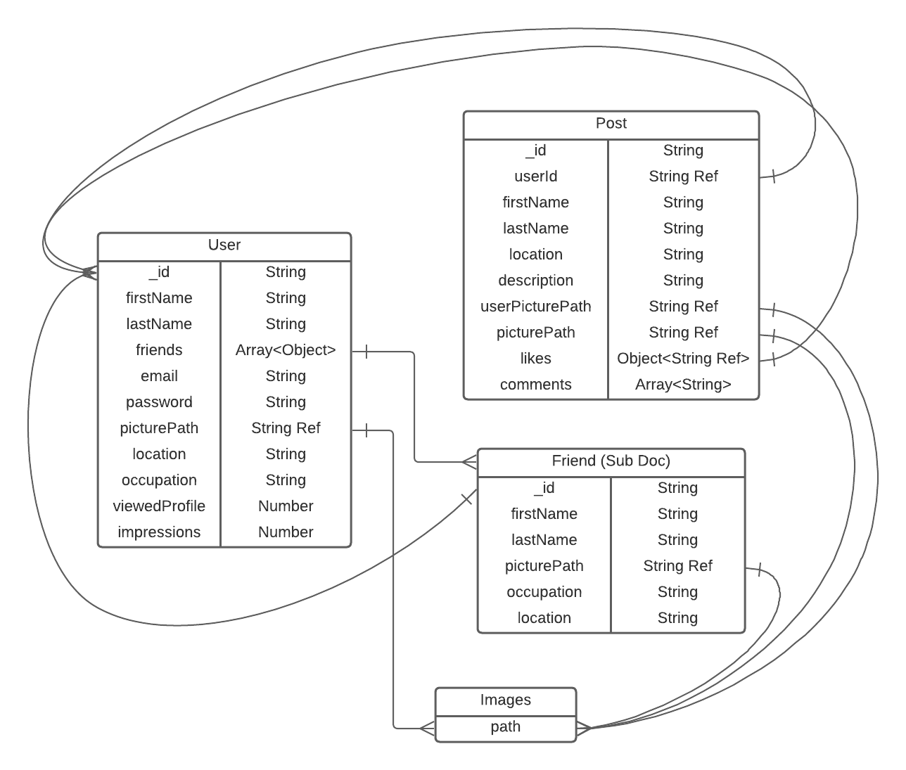

# FreeBlueBird

Full Stack Social Media Web App built with MERN

## Technologies used:

## Deployment:

- [Vercel Front-End Deployment](https://sociopedia-app.vercel.app)
- [Render API Deployment](https://freebluebird-api.onrender.com)

## MongoDB Schema:

